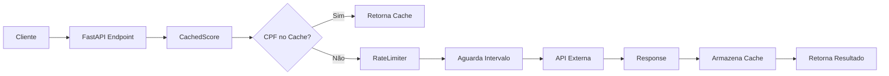

# Proxy para gestão de requisições para a API de Score

Este projeto implementa um proxy para uma API externa de consulta de score, aplicando padrões de design para adicionar funcionalidades de cache para requisições recentes e rate limiting.

## Arquitetura e Padrões

### Decisões de Design

Para o projeto atual, foram aplicados os padrões de projeto Decorator e Singleton. O primeiro foi feito através da criação de classes separadas (`CachedScore` e `RateLimiter`) que implementam uma 
principal (Score) adicionando funcionalidades diferentes entre si. O **Fluxo de funcionamento** é `Score` → `RateLimiter` → `CachedScore`; o segundo padrão usado pode ser visto com as instâncias globais dos 
serviços na `main.py`, garantindo compartilhamento de cache entre requisições e controle centralizado do rate limiting.

Ademais, percebemos que o padrão Factory poderia ser encaixado também, visto que permitiria variações da configuração do proxy (com/sem cache, diferentes intervalos de rate limiting) e facilitando implantações 
em ambientes diferentes. E utilizamos Postman para entender melhor o fluxo de requisições.

### Bibliotecas Utilizadas

- **FastAPI**: Framework web para criação da API proxy
- **Requests**: Cliente HTTP para comunicação com a API externa
- **Time**: Gerenciamento temporal do rate limiter
- **Uvicorn**: Servidor ASGI para execução da aplicação
 
O servidor pode ser executado tanto com ```uvicorn main:app --reload``` ou ```fastapi dev main```.

### Estrutura do Projeto

```
├── main.py           # FastAPI app e configuração dos serviços
├── score.py          # Classe base para requisições HTTP
├── cachedScore.py    # Decorator que adiciona cache
├── ratelimitt.py     # Decorator que adiciona rate limiting
└── teste.py          # Script de testes automatizados
```

### Fluxo de Requisição



## Instalação e Execução

### Pré-requisitos

- Python 3.7+
- pip

### Instalação das Dependências

```bash
# Instalar bibliotecas necessárias
pip install fastapi uvicorn requests
```


### Execução

```bash
# Iniciar o servidor com Uvicorn
uvicorn main:app --reload

# Ou com FastAPI
fastapi dev main.py

# Em outro terminal, executar testes
python teste.py
```

## 📡 Endpoints e Uso

### 1. Consulta de Score

**Endpoint**: `GET /consulta/`

**Parâmetros**:
- `cpf` (string): CPF para consulta, passada na url
- `client-id` (string): Id do cliente, passado pelo header

### Comportamento

- **Primera consulta**: Faz requisição HTTP + armazena no cache
- **Consultas subsequentes**: Retorna do cache (mais rápido)
- **Rate Limiting**: Sempre aplica intervalo de 1 segundo entre requisições

## 🧪 Testes

### Teste Automatizado

O arquivo `teste.py` exercita o sistema com diferentes cenários:

```bash
python teste.py
```

**Cenários testados**:
- 3 CPFs únicos inicialmente
- 15+ repetições do primeiro CPF (teste de cache)
- 8 repetições de cada CPF subsequente
- Total: 33 requisições

### Teste Manual (Postman)

1. Create new request
2. Atualizar a url para http://127.0.0.1:8000/consulta/?cpf={cpf}
3. Incluir variável id_cliente e inserir um valor para esta
4. **Observar tempos** de resposta (cache vs HTTP)

## 📊 Relato Técnico

### Padrões Adotados

#### **Decorator Pattern**
- **Adotado**: Permite composição flexível de funcionalidades
- **Benefícios**: 
  - Separação clara de responsabilidades
  - Fácil remoção/adição de features
  - Testabilidade individual
- **Trade-off**: Pequena complexidade adicional na cadeia de chamadas

#### **Singleton Pattern**
- **Adotado**: Instâncias globais garantem estado compartilhado
- **Benefícios**:
  - Cache persistente entre requisições
  - Rate limiting global efetivo
- **Trade-off**: Menor flexibilidade em testes unitários

### Padrões Considerados

#### 🔄 **Factory Pattern**
- **Status**: Não implementado, mas identificado como melhoria
- **Justificativa para não adotar**: Simplicidade do escopo atual
- **Potencial futuro**: Diferentes configurações por ambiente
- **Implementação sugerida**:
  ```python
  # Possibilidade futura
  service = ScoreServiceFactory.create(
      use_cache=True,
      rate_limit_interval=2.0,
      environment="production"
  )
  ```

### Experimentos e Resultados

#### Teste de Performance

**Setup**: 33 requisições (3 CPFs únicos com repetições)

Pôde-se perceber que a primeira requisição de qualquer CPF tem tempo reduzido pois não há espera prévia no rate limiter. Além disso, talvez por causas de instalação do python, alto número de requisições à API 
ou sistema operacional do usuário, pode ser obtido um tempo mínimo alto entre as requisições.

#### Comportamento do Cache

- **Cache Hit Rate**: ~85% nas execuções de teste
- **Benefício**: Redução significativa de chamadas à API externa
- **Persistência**: Cache mantido durante vida da aplicação

#### Rate Limiting

- **Intervalo configurado**: 1 segundo
- **Comportamento**: Aplicado mesmo para cache hits
- **Efetividade**: Previne sobrecarga tanto da API externa quanto interna

### Análise Crítica: Trade-offs

#### **Pontos Fortes**

1. Rate limiting protege contra sobrecarga
2. Cache reduz latência e chamadas externas  
3. Padrões facilitam extensão e modificações

#### **Trade-offs Identificados**
   - Cache consome memória RAM
   - Singleton dificulta testes isolados
   - Comportamento consistente em produção
   - Factory pattern faria injeção de dependência
   - Operações bloqueantes durante rate limiting
---
